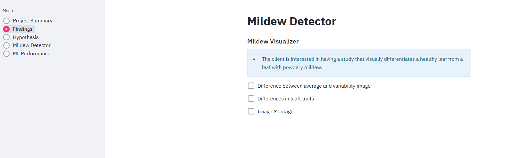

# Mildew Detector

[**Link to deployed site**](https://wizard-mildew-detector-f7969adf8c63.herokuapp.com/)

## Dataset Content

- The dataset is sourced from [Kaggle](https://www.kaggle.com/codeinstitute/cherry-leaves). 
- The dataset contains +4 thousand images taken from the client's crop fields. The images show healthy cherry leaves and cherry leaves that have powdery mildew, a fungal disease that affects many plant species. The cherry plantation crop is one of the finest products in their portfolio, and the company is concerned about supplying the market with a compromised quality product.

## Business Requirements

The cherry plantation crop from Farmy & Foods is facing a challenge where their cherry plantations have been presenting powdery mildew. Currently, the process is manual verification if a given cherry tree contains powdery mildew. An employee spends around 30 minutes in each tree, taking a few samples of tree leaves and verifying visually if the leaf tree is healthy or has powdery mildew. If there is powdery mildew, the employee applies a specific compound to kill the fungus. The time spent applying this compound is 1 minute. The company has thousands of cherry trees located on multiple farms across the country. As a result, this manual process is not scalable due to the time spent in the manual process inspection.

To save time in this process, the IT team suggested an ML system that detects instantly, using a leaf tree image, if it is healthy or has powdery mildew. A similar manual process is in place for other crops for detecting pests, and if this initiative is successful, there is a realistic chance to replicate this project for all other crops. The dataset is a collection of cherry leaf images provided by Farmy & Foods, taken from their crops.

- 1 - The client is interested in conducting a study to visually differentiate a healthy cherry leaf from one with powdery mildew.
- 2 - The client is interested in predicting if a cherry leaf is healthy or contains powdery mildew.

## Hypothesis and validation

**Hypothesis:**
Using a dataset, I hypothesis we can apply machine learning techniques to analyze the various leaf traits such as discoloration and shape so images can accurately be distinguished between healthy leaves and those affected by powdery mildew.

**Validation:**
Using the dataset we split the data into test, train and validation test sets to to train an ml model to compared differences between images that exhibit noticeable but small variations in shape and color.
Training an ml model using convolution neural networks of to analyze the average images of healthy leaves and those affected by powdery mildew, we identified key patterns such as discoloration and subtle shape changes, that distinguish the diseased leaves from healthy ones.

## The rationale to map the business requirements to the Data Visualisations and ML tasks

**Buisness requirements:**

To speed up the process of detirmening if cherry tree leaves are infected with powdery mildew.

**Rationale:**

- Data Visualizations: Visualizations were essential in understanding the dataset's structure and patterns. They allowed us to assess class balance, determine the average image size, and analyze differences in image traits between healthy and infected leaves. This helped in preparing the data effectively for machine learning tasks.

- Machine Learning Tasks: The ML process focuses on automating the identification of powdery mildew. Data preparation involved labeling the dataset into healthy and infected categories, splitting it into training, validation, and test sets. These sets were used to train models that analyze and compare leaf images, producing a system capable of accurate detection. Multiple iterations of model training were conducted to optimize for accuracy, loss, and file size, ensuring the model is suitable for live deployment.

## ML Business Case

Implement a machine learning system to automate the classification of healthy and powdery mildew-infected leaves. This approach eliminates the need for time-intensive manual inspections and provides instant, accurate detection. By automating leaf classification with machine learning, this system enhances efficiency and supports innovation in agricultural practices, paving the way for broader applications in smart farming.

## Dashboard Design

### 1. [Home Page/Project Summary](https://wizard-mildew-detector-f7969adf8c63.herokuapp.com/)

- Purpose: Provide a brief introduction and overview of the dashboard.
- Features:
    - A welcoming message explaining the tool's purpose.
    - Links or navigation buttons to access different sections of the dashboard.
    - Key objectives of the tool outlined for the user.

### 2. [Findings Page](https://wizard-mildew-detector-f7969adf8c63.herokuapp.com/)

- Purpose: The Findings Page gives a clear, visual, and easy-to-understand summary of the testing process and results that helped build the Machine Learning (ML) model. It shows the key differences between healthy and infected leaves and lets users see the data that trained the model.

- Feautrures:
    - Displays side-by-side images comparing the average and variable appearance of healthy leaves versus infected leaves.
    - Displays side-by-side images and overlay to show how these differ on average between healthy and infected samples.
    - A gallery of sample images from the dataset used for training, including both healthy and infected leaves.

### 3. [Hypothesis Page](https://wizard-mildew-detector-f7969adf8c63.herokuapp.com/)

- Purpose: The Hypothesis Page provides a clear explanation of the assumptions or predictions made before building the ML model. It also informs users about whether these assumptions were validated successfully.
- Features:
    - Hypothesis of the outcome.
    - Succes message of the validation

### 4. [Mildew Detector Page](https://wizard-mildew-detector-f7969adf8c63.herokuapp.com/)

- Purpose: Allow users to upload images of cherry leaves and predict whether the leaves are healthy or contain powdery mildew.
- Features:
    - File Uploader: Enables users to upload multiple images (.png, .jpg, .jpeg).
    -  Image Display: Displays the uploaded image along with its dimensions.
    - Prediction Output:
        - Visual representation of prediction probabilities (e.g., bar chart or pie chart).
        - Classifies each image as "Healthy" or "Powdery Mildew".
    - Results Table: Summarizes the results for all uploaded images in a tabular format.
    - Downloadable Report: Provides a downloadable CSV report containing the predictions.

### 5. [ML Performance Metrics Page](https://wizard-mildew-detector-f7969adf8c63.herokuapp.com/)

- Purpose: Showcase the performance of the machine learning model used for mildew detection.
- Features:
    - Label Distribution: Visual representation of the class distribution (Healthy vs. Powdery Mildew) in the training, validation, and test datasets.
    - Model:
        - Displays key metrics such as loss and accuracy on the test dataset.
        - Data displayed in a table for clarity.

## Bugs

### 1. Issue: Overlaying Average Validation Image

- Problem: Unable to overlay the average validation image as intended during development.

### 2. Issue: Large Files and Git Commit

- Problem: Encountered issues pushing to Git due to files being too large.
- Resolution: Spent 13 hours fixing this by identifying and deleting large files.

### 3. Issue: Streamlit Run Not Opening Selected File

- Problem: When using streamlit run, the app failed to open the file from the app_pages folder, but it worked when providing the file path manually in the terminal.

### 4. Issue: Case Sensitivity in Class Name

- Problem: app.py could not locate the app_pages folder because the Multipage class was miswritten as multipage, which is case-sensitive.
- Resolution: Corrected the class name to Multipage.

### 5. Issue: Missing Evaluation File and Large File Pushing

- Problem: Missing evaluation.pk1 file required rerunning the Jupyter notebook to regenerate it. However, the file was too large to push to Git.
- Resolution:
Pushed individual files to Git.
Identified that trained_model.h5 was the actual issue.
Used Git LFS (Large File Storage) to handle the large .h5 file.

### 6. Issue: Committed Files Ignored by .gitignore

- Problem: Previously committed files that were later added to .gitignore remained tracked.
- Resolution:
Used git rm --cached -r . to untrack files.
Re-added files with git add ., committed the changes, and pushed them back to the repository with .gitignore rules applied.

### 7. Issue: Conformance to PEP8 Standards

- Action: Ran autopep8 on Python code to ensure adherence to PEP8 standards.

### 8. Issue: Montage Section Not Working on Live Site

- Problem: The "create montage" section worked locally but failed on the live site.
Cause: The validation set was ignored in .gitignore, but the function needed it.
- Resolution: Removed the validation set from .gitignore and redeployed. The issue was resolved.

### 9. Issue: Predictive Analytics Stopped Working on Live Site

- Problem: The predictive analytics section worked locally but failed on the live site.
- Cause: H5 file size too large and compressed with git lfs
- Resolution:
Compressed files using Git LFS and adjusted Heroku build packs.
Despite model accuracy, reduced the layers in the model to make it smaller for deployment.
Identified Git LFS stored all .h5 files, which Heroku couldn’t read.
Removed LFS, uninstalled Git LFS, removed .h5 files from .gitattributes, and re-pushed the original file.

## Deployment

- I linked my GitHub repository to Heroku and chose the manual deployment option to avoid accidentally deploying untested or buggy code.

- Older Python Version Issue:
    - My app needed a specific Heroku stack (heroku-20) to support my code.

- Using API Key to Log into Heroku via Terminal:
    - I had to authenticate in my terminal using Heroku’s API key because the stack change wasn’t something I could handle directly from the Heroku dashboard.

- Changed the Heroku Stack:
-    I updated the stack to heroku-20 to work with the version of Python i was running

## Main Data Analysis and Machine Learning Libraries

## Testing

Tested the functionality of the local and live site by testing each page and input to ensure they meet the required functions.
I used manual testing to navigate through the pages testing inputs with correct and incorrect values to identify any bugs.

- Navigation:
    - Confirmed all links and buttons worked as intended and sufficient loading times achieved.

- Mildew detection image input:
    - Checked that the file types as suggested all work and other file types are not accepted.

- ML Prediction:
    - Checked that the prediction function is working as intended over many trials to determine if a leaf is healthy or has powdery mildew. This is where i came across the "9. Issue: Predictive Analytics Stopped Working on Live Site bug." that ended up taking over a week to problem solve.

- Python linter:
    - Checked over python code with the code institue linter to make sure it was all pep8 compliant

## Credits

- For this project i was using the Code Institute Malaria Walkthough as a guide and example.

### Content

- Malaria Detector Walkthrough: For structure and parts of code
- Chatgpt: For problem sovling the git lfs bug and checking my spelling and grammmer
- Streamlit documentaion: For git lfs bug help
- Tomdu3 brain tumor detector project for code comparison for when i had missing .h5 issue

### Media

- Streamlit
- Jupyter Notebook
- NumPy
- Pandas
- Plotly
- Seaborn
- Matplotlib
- TensorFlow
- Python
- Heroku
- GitHub
- Vs Code
- GitPod
- Am I Responsive
- Code Institute Python Linter
- Chat Gpt
- Stack Overflow
- Slack PA community group

## Acknowledgements

- Josie for supporting me and pushing me forward.
- David Bowers: Once again supporting and encouraging me.
- Doom 2 mods: For those dark moments chasing my tail with errors, doom gave me the outlet to vent my frustrations giving me focus to continue my efforts.
- The slack community for helping me narrow down my h5 bug
